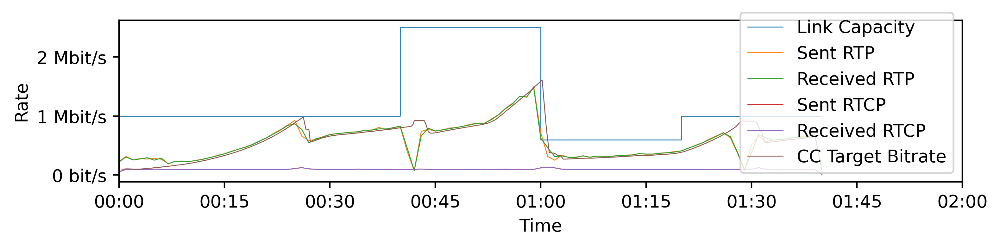
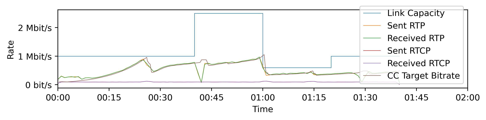
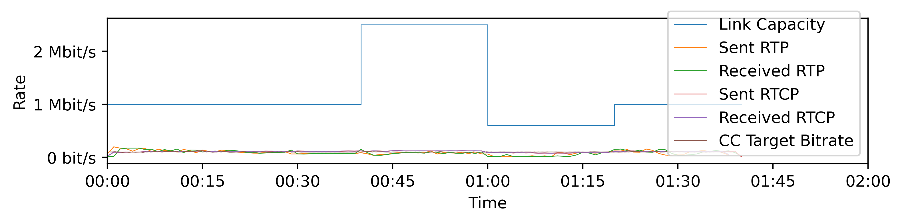
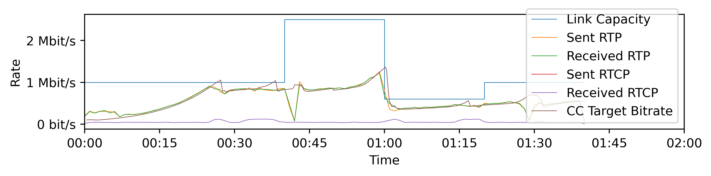

# Congestion Control for RTP over QUIC Simulations

This repository contains simulation and visualization scripts for running RTP over QUIC with different congestion control settings.

The test environment is loosely based on [RFC 8867](https://datatracker.ietf.org/doc/rfc8867/), but currently only the first test case is implemented.

The test uses [Mininet](http://mininet.org/) to setup the simulation environment and Linux `tc` to simulate delay and different bandwidths.

The [RTP over QUIC implementation](https://github.com/mengelbart/rtp-over-quic/) is included as a Git submodule.
It uses [SCReAM](https://github.com/EricssonResearch/scream/) as real-time media congestion control and [Gstreamer](https://gstreamer.freedesktop.org/) for video coding.

## Running

1. Make sure to install Mininet, Gstreamer, Golang and a C/C++ Compiler.
2. Pull Git submodules.
3. Build RTP over QUIC: `cd` into the `rtp-over-quic` directory and run `go build`
4. Run `./main.py` (use `-h` for a list of options) (this will run the tests and create various logfiles in `data/`)
5. Run `./plot.py` (use `-h` for al ist of options) or `./plot.sh` to visualize the results.

If you want to configure different tests, check out the `implementations.json` file.

## Results

Here are some sample results for the four default configurations.
All tests use QUIC Datagrams to send RTP packets.
The test uses a sequence from [Sintel](https://en.wikipedia.org/wiki/Sintel).

### QUIC + SCReAM

Use SCReAM congestion control for RTP.
SCReAM runs at the application layer, QUIC's congestion control is disabled.

### QUIC + SCReAM + NewReno

Use SCReAM congestion control for RTP. SCReAM runs at the application layer and QUIC's NewReno congestion control is enabled.

### QUIC + SCReAM + NewReno + Stream

Use SCReAM congestion control for RTP.
SCReAM runs at the application layer and QUIC's NewReno congestion control is enabled.
Next to sending the RTP Datagrams, the application also opens a QUIC stream to send.
The data sent on the stream is only congestion controlled by the same NewReno controller.

### UDP + SCReAM

Sends RTP over UDP using SCReAM for reference/comparison with QUIC.

